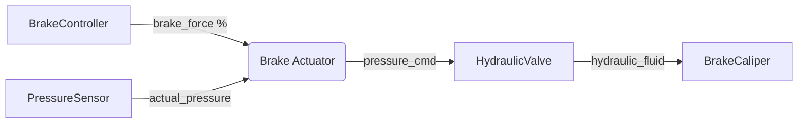

# Technical Specification: Brake Actuator

## Introduction

The `brake_actuator` component is responsible for receiving high-level brake force commands from the brake controller and translating them into hardware-specific control signals for the hydraulic brake system. This component serves as the interface between software control and physical actuation hardware.

The component receives brake force percentage commands, converts them to hydraulic pressure setpoints, and controls the electro-hydraulic brake actuator to achieve the desired pressure while monitoring actual pressure feedback.

## Requirements

Links to software requirements this component implements:

- [REQ_BA_RECEIVE_COMMANDS](brake_actuator.swreq.md#REQ_BA_RECEIVE_COMMANDS)
- [REQ_BA_CONVERT_FORCE](brake_actuator.swreq.md#REQ_BA_CONVERT_FORCE)
- [REQ_BA_CONTROL_HYDRAULICS](brake_actuator.swreq.md#REQ_BA_CONTROL_HYDRAULICS)
- [REQ_BA_MONITOR_PRESSURE](brake_actuator.swreq.md#REQ_BA_MONITOR_PRESSURE)
- [REQ_BA_SAFETY_LIMITS](brake_actuator.swreq.md#REQ_BA_SAFETY_LIMITS)

## Architecture



## Software Component

### Inputs

**Brake Command** (`/vehicle/brake/command`)

- `brake_force_percent` (float): Commanded brake force [0, 100] percent
- `timestamp` (int64): Command timestamp
- `status` (enum): Command status (NOMINAL, EMERGENCY, ERROR)
- Expected update rate: 50 Hz
- Maximum age: 30 ms

**Pressure Feedback** (Analog sensor)

- `actual_pressure_bar` (float): Measured hydraulic pressure in bar
- Valid range: [0, 150] bar
- Sample rate: 1000 Hz
- Precision: 0.1 bar

### Outputs

**Hydraulic Valve Command** (PWM signal)

- `valve_duty_cycle` (float): PWM duty cycle [0, 100] percent
- Update rate: 1000 Hz (1 ms period)
- Resolution: 0.1 percent

**Actuator Status** (`/vehicle/brake/actuator_status`)

- `actual_pressure_bar` (float): Current hydraulic pressure
- `target_pressure_bar` (float): Commanded pressure
- `status` (enum): Actuator status (ACTIVE, FAULT, DEGRADED)
- Publishing rate: 50 Hz

### Component Logic

#### Initialization

At component startup:

1. Initialize hardware interfaces (PWM output, analog input)
2. Perform actuator self-test (valve cycling, pressure check)
3. Load calibration parameters (force-to-pressure mapping)
4. Subscribe to brake command topic
5. Begin control loop at 1000 Hz

#### Processing Cycle (1ms)

The component runs two loops:

**Fast Loop (1000 Hz)**: Pressure control

1. Read pressure sensor
2. Calculate pressure error
3. Run PI controller
4. Output PWM command to valve

**Slow Loop (50 Hz)**: Command processing

1. Receive brake force command
2. Convert force to target pressure
3. Update controller setpoint
4. Publish actuator status

#### Force to Pressure Conversion

Brake force percentage is converted to hydraulic pressure:

```
target_pressure = brake_force_percent × max_pressure / 100

Where:
  max_pressure = 120 bar (calibrated for vehicle mass and brake calipers)

Example:
  50% brake force → 60 bar target pressure
  100% brake force → 120 bar target pressure
```

#### Pressure Control Loop

A PI (Proportional-Integral) controller maintains hydraulic pressure:

```
error = target_pressure - actual_pressure
integral_error += error × dt
valve_command = Kp × error + Ki × integral_error

Where:
  Kp = 5.0  (proportional gain, % per bar)
  Ki = 2.0  (integral gain, % per bar-sec)
  dt = 0.001s (1ms control loop)
```

Output is clamped to [0, 100] percent duty cycle.

## Constraints on the Interfaces

### Brake Command Input

- **Valid range**: [0, 100] percent
- **Expected update rate**: 50 Hz
- **Maximum age**: 30 ms
- **Timeout action**: Ramp pressure to zero over 100ms

### Pressure Sensor

- **Valid range**: [0, 150] bar
- **Sample rate**: 1000 Hz
- **Precision**: 0.1 bar
- **Out-of-range action**: Enter FAULT state, release pressure

### Hydraulic Valve Output

- **PWM frequency**: 1000 Hz
- **Duty cycle range**: [0, 100] percent
- **Resolution**: 0.1 percent
- **Response time**: < 10ms to 90% pressure

## Interface to Hardware and Operating System

The component requires direct hardware access for real-time performance:

Requirements:

- CPU: ~5% average, ~15% peak (1000 Hz control loop)
- Memory: ~2 MB resident
- GPIO: PWM output channel, analog input channel
- Priority: 90 (highest, time-critical)

Hardware interfaces:

- PWM output: GPIO pin 14 (electro-hydraulic valve)
- Analog input: ADC channel 2 (pressure sensor, 0-5V → 0-150 bar)

## Security Details

### Security Relevant Assumption

The component operates with direct hardware access and assumes:

- Hardware interfaces are physically secured
- No unauthorized access to GPIO/ADC peripherals
- Brake commands are authenticated upstream

### Process Information

- Process name: `brake_actuator`
- User: `vehicle_actuators` (elevated privileges for hardware access)
- Priority: 90 (real-time, highest priority)
- CPU affinity: Core 3 (dedicated for actuators)
- Memory limit: 10 MB (locked to prevent paging)

### Resource Access

#### Storage Data

The component loads calibration from:

- Actuator calibration file: `brake_actuator_cal.yaml`

File is read-only and validated with checksums at load time.

#### Hardware Access

Direct hardware access:

- `/dev/pwm0` - Hydraulic valve control
- `/dev/adc0` - Pressure sensor readback
- Requires elevated permissions (group: `hw_actuators`)

#### Inter-Process Communication

- Subscribes to: `/vehicle/brake/command`
- Publishes to: `/vehicle/brake/actuator_status`
- Uses real-time shared memory transport

### Logging and Error Log Information

The component logs:

- Initialization and self-test results at INFO level
- Pressure control errors (> 10 bar deviation) at WARNING level
- Hardware faults and sensor failures at ERROR level
- Pressure values at DEBUG level (disabled in production)

Logs are rate-limited to prevent flooding during faults.

### Session Handling

Not applicable. Component runs continuously while vehicle is powered.

### Used Cryptographic Primitives

None. All security provided by execution framework and hardware security.

## Appendices

### PI Controller Tuning

The PI gains were tuned using:

- Ziegler-Nichols method for initial values
- Step response testing on brake test stand
- Optimized for fast response with minimal overshoot

Controller performance:

- Rise time: < 50 ms to 90% target
- Overshoot: < 5%
- Steady-state error: < 1 bar

### Safety Limits

Hard limits enforced in firmware:

1. **Maximum pressure**: 150 bar (hardware limit)
2. **Ramp rate limit**: 50 bar/s (prevent shock)
3. **Timeout safety**: Release pressure if no command for > 100ms
4. **Sensor fault**: Release pressure if sensor out of range

### Hydraulic System Specifications

Brake system characteristics:

- Working pressure: 0-120 bar
- Maximum pressure: 150 bar (relief valve)
- Brake caliper effective area: 25 cm²
- Brake pad friction coefficient: 0.4
- Estimated brake force at 100 bar: ~10 kN per wheel
