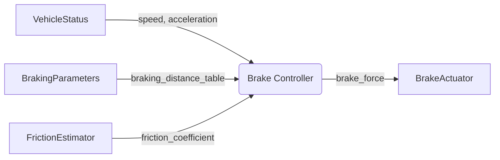

# Technical Specification: Brake Controller

## Introduction

The `brake_controller` component is responsible for calculating and commanding appropriate brake force to
achieve desired vehicle deceleration. This component implements the core control logic for the braking
system, using vehicle parameters and real-time sensor data to determine optimal braking force.

The component uses the braking distance lookup table to determine the relationship between speed, friction
coefficient, and required braking distance, then calculates the necessary brake force to achieve safe
stopping within those constraints.

## Requirements

Links to software requirements this component implements:

- [REQ_BC_CALCULATE_FORCE](brake_controller.swreq.md#REQ_BC_CALCULATE_FORCE)
- [REQ_BC_MONITOR_DECELERATION](brake_controller.swreq.md#REQ_BC_MONITOR_DECELERATION)
- [REQ_BC_USE_BRAKING_TABLE](brake_controller.swreq.md#REQ_BC_USE_BRAKING_TABLE)
- [REQ_BC_EMERGENCY_BRAKE](brake_controller.swreq.md#REQ_BC_EMERGENCY_BRAKE)

## Architecture



## Software Component

### Inputs

**Vehicle Status** (`/vehicle/status`)

- `speed_mps` (float): Current vehicle speed in meters per second
- `acceleration_mps2` (float): Current acceleration in m/s²
- Valid range: speed [0, 30] m/s, acceleration [-15, 5] m/s²
- Expected update rate: 50 Hz
- Maximum age: 40 ms

**Friction Coefficient** (`/vehicle/friction_estimate`)

- `friction_coefficient` (float): Estimated road friction coefficient
- Valid range: [0.3, 0.9]
- Expected update rate: 10 Hz
- Maximum age: 200 ms

**Braking Parameters** (configuration)

- `braking_distance_table`: Lookup table mapping (speed, friction) → braking_distance
- Loaded at startup from vehicle parameters
- References: [@braking_distance_table](/examples/vehicle_params.bzl#braking_distance_table)

### Outputs

**Brake Command** (`/vehicle/brake/command`)

- `brake_force_percent` (float): Commanded brake force as percentage [0, 100]
- `timestamp` (int64): Command timestamp in nanoseconds
- `status` (enum): Command status (NOMINAL, EMERGENCY, ERROR)
- Publishing rate: 50 Hz

### Component Logic

#### Initialization

At component startup:

1. Load braking distance table from vehicle parameters
2. Validate table dimensions (6 rows minimum)
3. Initialize state variables (previous_speed, integral_error)
4. Subscribe to required input topics
5. Start publishing brake commands at 50 Hz

#### Processing Cycle (20ms)

Each processing cycle performs these steps:

1. **Read Inputs**: Fetch latest vehicle status and friction estimate
2. **Validate Inputs**: Check age, range, and validity of all inputs
3. **Calculate Target Deceleration**: Based on current speed and braking distance table
4. **Calculate Brake Force**: Using PID controller with feed-forward term
5. **Apply Limits**: Clamp brake force to [0, 100] percent
6. **Publish Command**: Send brake command with timestamp and status

#### Brake Force Calculation

The brake force is calculated using a PID controller:

```python
target_decel = lookup_table(speed, friction)
error = target_decel - current_accel
brake_force = Kp * error + Ki * integral_error + Kd * derivative_error + feedforward
```

Where:

- `Kp = 2.5` (proportional gain)
- `Ki = 0.5` (integral gain)
- `Kd = 0.1` (derivative gain)
- `feedforward` is calculated from braking distance table

#### Emergency Braking

If any of these conditions occur:

- Input timeout (vehicle status age > 40ms)
- Speed exceeds maximum (> 30 m/s)
- Invalid friction estimate

Then the component enters emergency braking mode:

- Set brake force to 100%
- Set status to EMERGENCY
- Log error condition
- Continue monitoring for recovery

## Constraints on the Interfaces

### Vehicle Status Input

- **Valid speed range**: [0, 30] m/s
- **Valid acceleration range**: [-15, 5] m/s²
- **Expected update rate**: 50 Hz
- **Maximum age**: 40 ms
- **Precision**: 0.01 m/s for speed, 0.1 m/s² for acceleration

### Friction Estimate Input

- **Valid range**: [0.3, 0.9]
- **Expected update rate**: 10 Hz
- **Maximum age**: 200 ms
- **Precision**: 0.01

### Brake Command Output

- **Valid range**: [0, 100] percent
- **Publishing rate**: 50 Hz (20 ms period)
- **Precision**: 0.1 percent
- **Latency**: Maximum 5 ms from input to output

## Interface to Hardware and Operating System

The component runs as a real-time process with priority 80. It requires:

- CPU: ~2% average, ~5% peak
- Memory: ~1 MB resident
- Network: CAN bus access for actuator commands

No direct hardware access. All hardware interaction through vehicle interface layer.

## Security Details

### Security Relevant Assumption

The component does not require specific security controls as it operates within a trusted execution environment. However, it assumes:

- Vehicle status inputs are authenticated and integrity-protected
- Brake actuator commands cannot be spoofed or intercepted
- Configuration parameters are validated at load time

### Process Information

- Process name: `brake_controller`
- User: `vehicle_control`
- Priority: 80 (real-time)
- CPU affinity: Core 2
- Memory limit: 10 MB

### Resource Access

#### Storage Data

The component loads configuration from:

- Vehicle parameters file: `vehicle_params.bzl`
- Braking calibration: `brake_calibration.yaml`

All files are read-only and validated with checksums at load time.

#### Inter-Process Communication

- Publishes to: `/vehicle/brake/command`
- Subscribes to: `/vehicle/status`, `/vehicle/friction_estimate`
- All communication uses shared memory transport with 1ms max latency

### Logging and Error Log Information

The component logs:

- Initialization and configuration at INFO level
- Mode changes (NOMINAL ↔ EMERGENCY) at WARNING level
- Input validation errors at ERROR level
- Performance metrics (cycle time, brake force) at DEBUG level

No sensitive data (speed, brake force values) in production logs.

### Session Handling

Not applicable. Component runs continuously while vehicle is powered.

### Used Cryptographic Primitives

None. All security provided by execution framework.

## Appendices

### Braking Distance Table Format

The braking distance table has the following structure:

```text
| velocity (m/s) | friction_coefficient | braking_distance (m) |
|----------------|----------------------|----------------------|
| 10.0           | 0.7                  | 7.1                  |
| 10.0           | 0.5                  | 10.0                 |
| 20.0           | 0.7                  | 28.6                 |
| 20.0           | 0.5                  | 40.0                 |
| 30.0           | 0.7                  | 64.3                 |
| 30.0           | 0.3                  | 150.0                |
```

The table is interpolated linearly for intermediate values.

### PID Controller Tuning

The PID gains were tuned using:

- Ziegler-Nichols method for initial values
- Manual refinement based on vehicle testing
- Validated across all speed and friction combinations

Controller performance:

- Settling time: < 500 ms
- Overshoot: < 5%
- Steady-state error: < 0.5 m/s²
