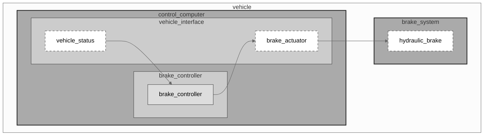

---
implements_requirements:
  - examples/requirements/REQ-BRK-001.sysreq.md
---

# Braking Control System Function

## Description

The Braking Control System Function is responsible for calculating and applying appropriate braking force
to ensure the vehicle can decelerate safely within specified distance constraints. This function implements
the system-level braking requirements and coordinates between multiple software components to achieve safe
vehicle stopping.

## Diagram

## Behavior

* The brake controller component receives vehicle status information including current speed and desired deceleration
* Based on the braking distance table parameters and current friction conditions, the component calculates required brake force
* The brake force command is sent to the brake actuator interface
* The actuator applies hydraulic pressure to the physical brake system
* The system continuously monitors actual deceleration and adjusts brake force as needed

## References

* [brake_controller](../brake_control/doc/brake_controller.techspec.md) - Software component implementing brake control logic
* [vehicle_status](../vehicle_status/doc/vehicle_status.techspec.md) - Software component providing vehicle state information
* [brake_actuator](../brake_actuator/doc/brake_actuator.techspec.md) - Software component interfacing with brake hardware
* [REQ-BRK-001](../requirements/REQ-BRK-001.sysreq.md) - System requirement for braking distance

## Links

| Link | Transport | Channel | Message |
| :--- | :-------- | :------ | ------: |
| `1`  | `Internal` | `/vehicle/status` | `vehicle_status (speed_mps, acceleration_mps2)` |
| `2`  | `Internal` | `/vehicle/brake/command` | `brake_command (brake_force_percent)` |
| `3`  | `CAN` | can_vehicle | `brake_actuator_cmd (pressure_bar)` |

## Open Topics

* Integration with ABS (Anti-lock Braking System) to be defined in future version
* Coordination with regenerative braking for electric/hybrid vehicles
