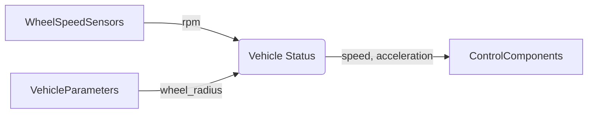

# Technical Specification: Vehicle Status

## Introduction

The `vehicle_status` component is responsible for reading vehicle sensor data, calculating derived quantities
(speed, acceleration), and publishing the current vehicle state for use by control components. This component
serves as the primary interface between raw sensor hardware and higher-level control algorithms.

The component reads wheel speed sensors, applies calibration factors, calculates vehicle speed and
acceleration, and publishes a consolidated vehicle status message at high frequency.

## Requirements

Links to software requirements this component implements:

- [REQ_VS_READ_SENSORS](vehicle_status.swreq.md#REQ_VS_READ_SENSORS)
- [REQ_VS_CALCULATE_SPEED](vehicle_status.swreq.md#REQ_VS_CALCULATE_SPEED)
- [REQ_VS_CALCULATE_ACCELERATION](vehicle_status.swreq.md#REQ_VS_CALCULATE_ACCELERATION)
- [REQ_VS_PUBLISH_STATUS](vehicle_status.swreq.md#REQ_VS_PUBLISH_STATUS)
- [REQ_VS_VALIDATE_SENSORS](vehicle_status.swreq.md#REQ_VS_VALIDATE_SENSORS)

## Architecture



## Software Component

### Inputs

**Wheel Speed Sensors** (CAN bus)

- `front_left_rpm` (uint16): Front left wheel speed in RPM
- `front_right_rpm` (uint16): Front right wheel speed in RPM
- `rear_left_rpm` (uint16): Rear left wheel speed in RPM
- `rear_right_rpm` (uint16): Rear right wheel speed in RPM
- Valid range: [0, 2000] RPM
- Expected update rate: 100 Hz
- Maximum age: 20 ms

**Vehicle Parameters** (configuration)

- `wheel_radius`: Effective wheel radius in meters
- `wheel_count`: Number of wheels (must be 4)
- Loaded at startup from vehicle parameters
- References: [@wheel_count](/examples/vehicle_params.bzl#wheel_count)

### Outputs

**Vehicle Status** (`/vehicle/status`)

- `speed_mps` (float): Vehicle speed in meters per second
- `acceleration_mps2` (float): Vehicle acceleration in m/s²
- `timestamp` (int64): Measurement timestamp in nanoseconds
- `status` (enum): Sensor status (VALID, DEGRADED, INVALID)
- Publishing rate: 100 Hz (10 ms period)

### Component Logic

#### Initialization

At component startup:

1. Load vehicle parameters (wheel radius, wheel count)
2. Validate configuration parameters
3. Initialize sensor input subscriptions
4. Initialize state variables (previous_speed, speed_history)
5. Begin publishing vehicle status at 100 Hz

#### Processing Cycle (10ms)

Each processing cycle performs these steps:

1. **Read Wheel Speeds**: Fetch latest wheel speed data from all 4 sensors
2. **Validate Sensors**: Check sensor age, range, and plausibility
3. **Calculate Vehicle Speed**: Average wheel speeds and convert to linear velocity
4. **Calculate Acceleration**: Derive from speed change over time
5. **Publish Status**: Send vehicle status message with timestamp

#### Speed Calculation

Vehicle speed is calculated from wheel speeds:

```python
# Convert each wheel RPM to linear velocity
wheel_velocity[i] = (wheel_rpm[i] * 2 * π * wheel_radius) / 60

# Average all valid wheel velocities
vehicle_speed = mean(wheel_velocity[0..3])
```

Sensor validation:

- If any sensor differs from mean by > 20%, mark as DEGRADED
- If 2+ sensors invalid, mark status as INVALID
- Use remaining valid sensors for calculation

#### Acceleration Calculation

Acceleration is calculated using a moving average filter:

```python
current_accel = (current_speed - previous_speed) / dt
filtered_accel = 0.7 * previous_accel + 0.3 * current_accel
```

Where:

- `dt = 0.01s` (processing cycle period)
- Filter reduces noise from discrete speed measurements

## Constraints on the Interfaces

### Wheel Speed Sensor Inputs

- **Valid range**: [0, 2000] RPM
- **Expected update rate**: 100 Hz
- **Maximum age**: 20 ms
- **Precision**: 1 RPM
- **Plausibility**: No wheel should differ from mean by > 30%

### Vehicle Status Output

- **Speed range**: [0, 30] m/s
- **Acceleration range**: [-15, 5] m/s²
- **Publishing rate**: 100 Hz (10 ms period)
- **Precision**: 0.01 m/s for speed, 0.1 m/s² for acceleration
- **Latency**: Maximum 2 ms from sensor read to publish

## Interface to Hardware and Operating System

The component runs as a real-time process with priority 85 (higher than control components).

Requirements:

- CPU: ~1% average, ~3% peak
- Memory: ~500 KB resident
- CAN bus access for wheel speed sensors

No direct hardware access. Sensors accessed through CAN driver.

## Security Details

### Security Relevant Assumption

The component operates within a trusted execution environment and assumes:

- Wheel speed sensors are physically tamper-resistant
- CAN bus messages are authenticated by lower layers
- No malicious sensor spoofing possible

### Process Information

- Process name: `vehicle_status`
- User: `vehicle_sensors`
- Priority: 85 (real-time, higher than control)
- CPU affinity: Core 1
- Memory limit: 5 MB

### Resource Access

#### Storage Data

The component loads configuration from:

- Vehicle parameters file: `vehicle_params.bzl`

File is read-only and validated with checksums at load time.

#### Inter-Process Communication

- Publishes to: `/vehicle/status`
- Subscribes to: CAN bus (wheel speed sensors)
- Communication uses shared memory with < 1ms latency

### Logging and Error Log Information

The component logs:

- Initialization and configuration at INFO level
- Sensor validation warnings at WARNING level
- Sensor failures and degradation at ERROR level
- Speed/acceleration values at DEBUG level (disabled in production)

### Session Handling

Not applicable. Component runs continuously while vehicle is powered.

### Used Cryptographic Primitives

None. All security provided by execution framework.

## Appendices

### Wheel Speed to Vehicle Speed Conversion

The conversion from wheel RPM to vehicle linear velocity:

```text
linear_velocity (m/s) = (RPM × 2π × wheel_radius) / 60

Example:
  wheel_radius = 0.3 m
  RPM = 500
  linear_velocity = (500 × 2π × 0.3) / 60 = 15.7 m/s
```

### Sensor Plausibility Checks

The component performs cross-validation between sensors:

1. Calculate mean of all 4 wheel speeds
2. Check each sensor deviation from mean
3. If deviation > 20%, mark sensor as suspect
4. If deviation > 30%, reject sensor reading
5. If < 3 sensors valid, mark status as INVALID

### Acceleration Filter Design

The first-order low-pass filter:

```text
α = 0.3  (filter coefficient)
y[n] = α × x[n] + (1 - α) × y[n-1]
```

Filter characteristics:

- Cutoff frequency: ~5 Hz
- Reduces measurement noise
- Acceptable phase lag for control
